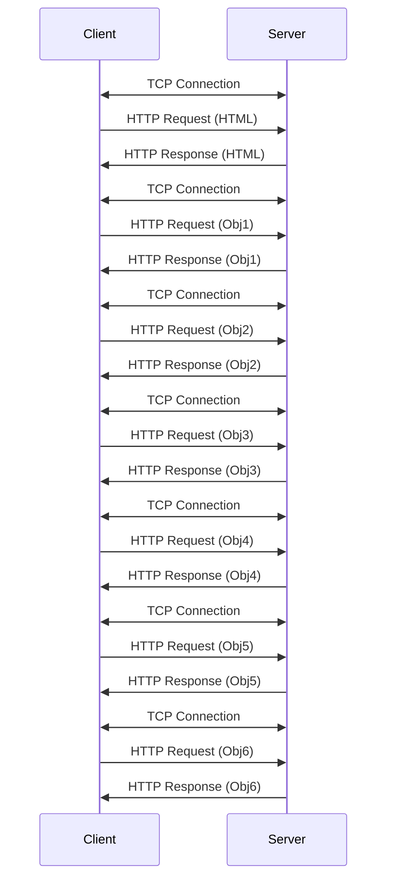
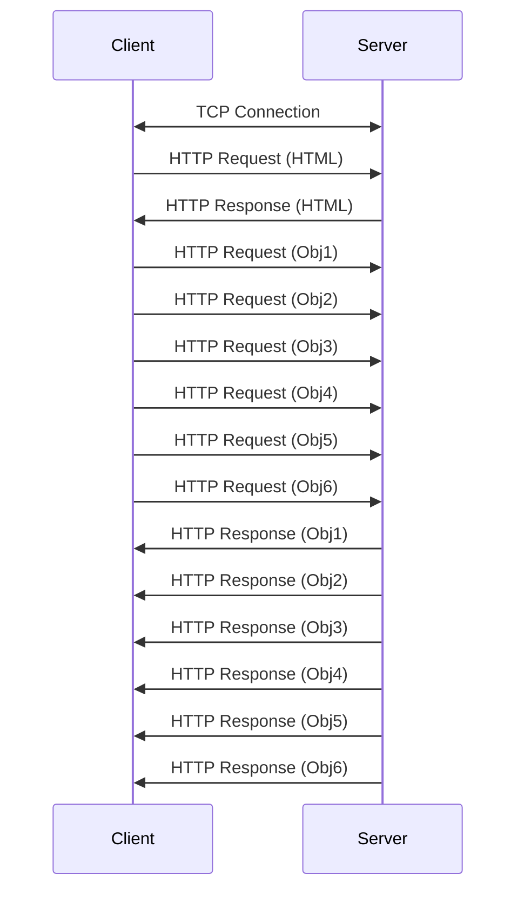

## Question 1 - True or False

<ol style="list-style-type: upper-alpha">
  <li>False very false first you get one response message then you find out you need to send 3 more responses.</li>
  <li>False it is litterally in the name non-persistent.</li>
  <li>False that is the date the response was generated.</li>
  <li>False the reply to an if modified request will not have a body if the file hadn't been modified.</li>
</ol>

## Question 2 - Wireshark Capture

### Part A - Complete URL

I belive the URL would be `http://gaia.cs.umass.edu/cs453/index.html`

### Part B - HTTP Version

The browser is using HTTP 1.1

### Part C - Type of Connection

The browser is using persistent connection hence why we see `connection:keep-alive`

### Part D - File Type

The file requested is `index.html` which is an html file.

## Question 3 - Elapsed Time for Web Page Retrival

### Part A - Non-Persistent & Non-Parallel HTTP

So A TCP connection needs a three-way handshak which is $1 {RTT}_w$ and for a non-persistent HTTP connection every request and response pair (also $1 {RTT}_w$) needs a new TCP connection and you need to wait in between each HTTP request so thats $7\times2\times {RTT}_w$ which is 14 round trip times.

### Part B - Persistent & Parallel HTTP

Here is the diagram.

Since we are ignoring transmission time then we essntially can think of the time between the the request for Obj1 and response for Obj6 equal to $1 {RTT}_w$ which make the total time about 3  round trip time.
